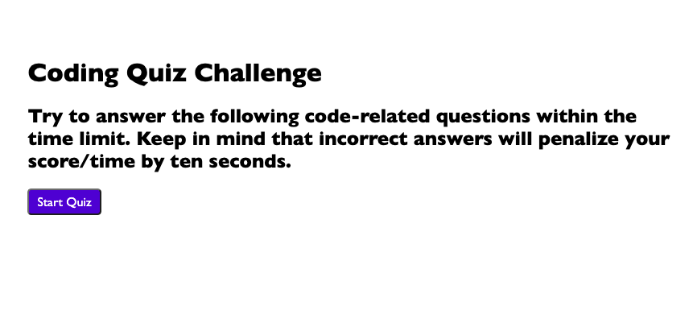
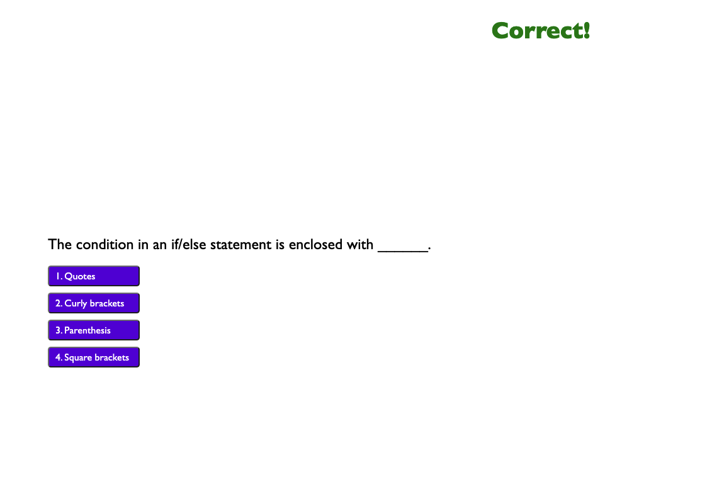
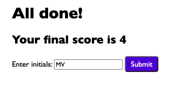
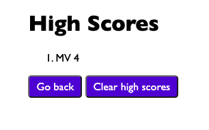

# Code-Quiz

https://madisenvo.github.io/Code-Quiz/

## Description
  
This timed quiz allows a user to test their code knowledge with multiple-choice questions and gives them the ability to save their initials and scores. 

## Usage

To use, click the "Start Quiz" button.

A question will appear. When an answer is selected, the program will tell the user if the answer was correct or wrong and present the next question.

If the answer clicked is wrong, 10 seconds will be deducted from the timer.

After completing the questions, the program will tell the user their score and allow them to enter their initials.

Initials and their corresponding scores can be viewed and cleared by clicking "View High Scores" in the top left corner.

## Features

Dynamic HTML and CSS powered by JavaScript
